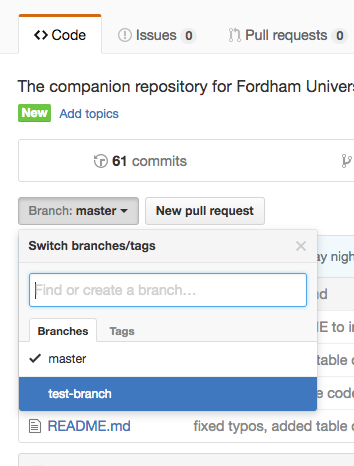

# Git Branching
Often times in software and web development, you want to build out features or experiment in your code base, but you don't want to affect your working code.  To alleviate this concern, Git introduces the concept of *branches*.

When you want to create or experiment with new features or implement bug fixes, you can *branch* off of your current, working project state.  This allows you to make and commit changes to your code in a different *branch* without affecting your main branch `master`.

## Your `master` branch
The `master` branch should be your *current, working* version.  Usually, the `master` branch is what is deployed to production environments, because it should be the most stable version of a project.

## Creating a new branch
When you are ready to start working on a new feature, you should create a new branch of your code from `master`.  Remember, `master` should always be the most up to date and stable version of your project, so branching off of it will make sure that you are starting with a fresh and stable version of your code before making any changes.

To check what branch you are on, run the `git branch` command.

```
$  git branch
* master
```

From the `master` branch, you can create a new branch using the `git checkout -b <NEW_BRANCH_NAME>` command.

```
$  git checkout -b test-branch
Switched to a new branch 'test-branch'
```

You are now in a new branch!  From this new branch, you can make changes to your code, commit those changes, and not affect the stable version of your code in your main `master` branch at all.

Once you have the changes to your code ready, you can commit the changes to your new branch using `git commit` (just like you normally would).

## Push your new branch up to GitHub
You can also keep track of your branches remotely by pushing them up to GitHub.  Use the `git push origin <BRANCH_NAME>` command to put your new branch on your remote repo.

```
git push origin test-branch
```

After you push up your new branch, head over to GitHub to make sure everything is up to date.  From your repository page, you'll see the `branch` dropdown menu.  Select the name of the branch you want to view, and click it



With the new branch selected, you'll see that GitHub is now showing you the version of your code with any changes you made in that branch.  From the `branch` dropdown menu, select the `master` branch again.  Under the `master` branch, all of your clean, stable code is still untouched.

## Switching Branches
From your command line, you can change back to your master branch using the `git checkout` command.  `git checkout <BRANCH_NAME>` will switch you to the branch that you specify. Run the checkout command to get back to your `master` branch.

```
git checkout master
Switched to branch 'master'
```

## Merging branches
As we discussed earlier, one of the reasons we create separate branches is so we can develop and test new features in our code without affecting our stable, working version.  But what do we do when we finish building out a new feature in a separate branch, and are ready to move that code over to our `master` branch?  We can *merge* the feature branch into our `master` branch.

Merging branches allows you to take the code that's in one branch, and copy it over to another branch.  To merge branches, you must do the following:

1. Make sure you are currently in the branch you want to *merge your new code into*
	```
	$  git branch
	* master
	```

2. Run `git merge <BRANCH_NAME>` to merge the code *from* the branch you specify _into_ the branch you are currently on.
	```
	git merge test-branch
	```

When you successfully merge one branch into another, git will tell you what changes were made and you can check that the code that you changed in your other branch is reflected in your `master` branch.

## Git Resources
The below resources are available to supplement the information you gained from the notes and lecture.

[*Pro Git*: Git Branching](https://git-scm.com/book/en/v2/Git-Branching-Branches-in-a-Nutshell)

[git - the simple guide](http://rogerdudler.github.io/git-guide/)

[Atlassian: Using Git Branches](https://www.atlassian.com/git/tutorials/using-branches)

[Atlassian: Git Merge](https://www.atlassian.com/git/tutorials/git-merge)

### Interactive Tutorials
[Codecademy: Learn Git](https://www.codecademy.com/learn/learn-git)

[Learn Git Branching](http://learngitbranching.js.org/)


