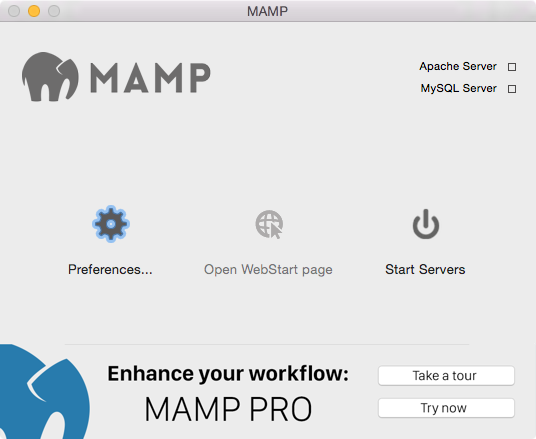
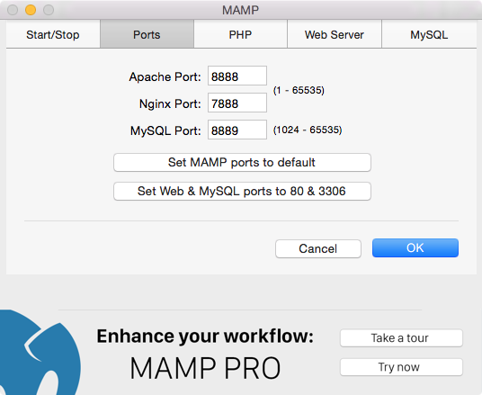
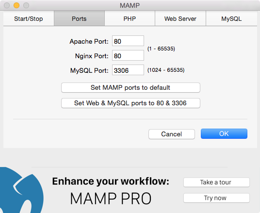
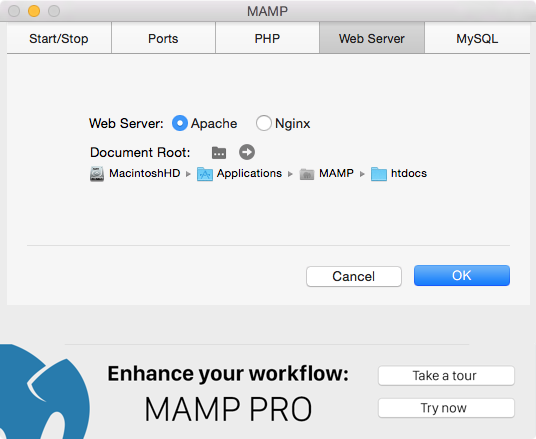
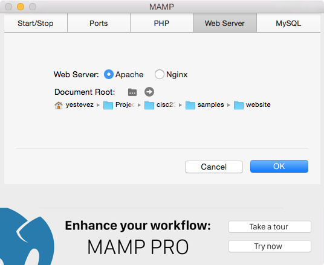

# Server Side Requirements
To get started with working on the server, there are a few technologies we should have:

- A server side programming/scripting language (PHP)
- A web server (Apache)
- A Database (MySQL)

We will discuss the MySQL database later in the semester, but for now let's take care of the first two requirements.

## PHP as our server side language
[PHP](https://secure.php.net/) is a server side scripting language, and is used to generate dynamic web pages.  It is a fairly flexible language while offering robust features and powerful capabilities.

## Apache as our web server
a *web server* is resposible for receiving requests and generating responses for the client side.  For this class, we will be using the [Apache web server](https://httpd.apache.org/).  Apache is the most popular and widely used web servers in use today.

## Installing MAMP
Setting up server side environment can be a long and complicated process, especially for beginners. In order to alleviate some of the strains of working with these technologies, we will be using the [MAMP](https://www.mamp.info/en/) application for our development purposes.  MAMP installs PHP, Apache, and MySQL onto your computer as well as handles most of the configuration and initial setup.  MAMP also comes with a handy GUI and helpful applications that makes it easier to interact with these technologies. To get MAMP, [download](https://www.mamp.info/en/downloads/) the version that is available for your operating system.

## Using MAMP
To get started with MAMP, open the application.  You may be prompted to use or download the MAMP Pro (paid) version of the app, you can just ignore that forever.

Let's have a look at the MAMP preferences, and dig into the two settings we might want to change: `Port` and `Web Server`

### Port Setting

For our web server, a *port* is what listens for requests from the client.  We can specify which *port number* we want our Apache web server to listen to when we make requests for our website pages.  Above, we see that the Apache port in MAMP is listening to port 8888. However, regular web requests tend to default to port 80, so let's push the button that says `Set Web & MySQL ports to 80 & 3306` to update the port that Apache will listen to.

### MAMP Web Server Settings
MAMP actually supports different web servers (Apache and NGINX).  Apache should be our chosen web server by default, so let's not change that.

You'll notice the second setting in this tab is the document root.  The *document root* is the location or path of your *website directory*.  Recall that your website directory is the directory that holds all of your files that make up your website.  So by setting your *document root* you are setting the location to point to your *website directory*.  By default, your document root should be set to `/Applications/MAMP/htdocs/` (might differ on windows).

We can change the location of our document root by clicking the little folder next to the "Document Root" setting in MAMP.  This will let us "start a new document root" and prompt us to navigate to the new location using the Finder/File Explorer. In the example below, I changed my document root to the CISC2350 sample website file that can be found at `cisc2350/samples/website/`.

Now, whenever I start my web server and navigate to the server address [`http://localhost:80`](http://localhost:80) our web server will know where to *serve* the website files from (the document root).

**NOTE** It is crucial that you set up your MAMP application as quickly as possible and test that it is working.  If you run in to problems, it could be very time consuming to debug the issue.  Please make sure to give yourself enough time to reach out for help if needed before the assignment is due.

## Resources
*Learning PHP, MySQL, JavaScript & CSS* - Chapter 2

___

[Next - Intro to PHP »](3-PHP.md)

